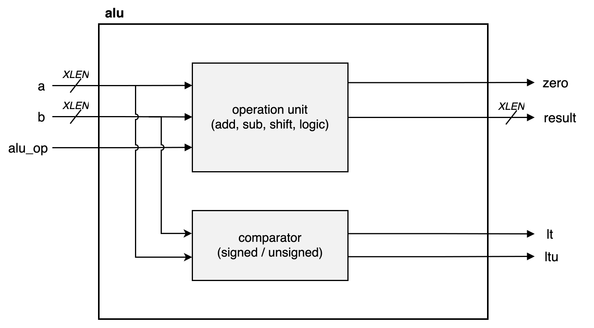
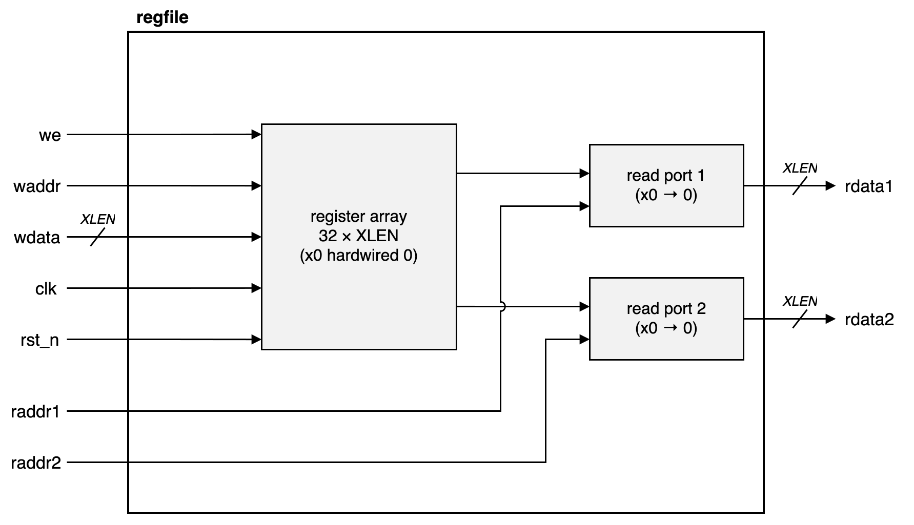
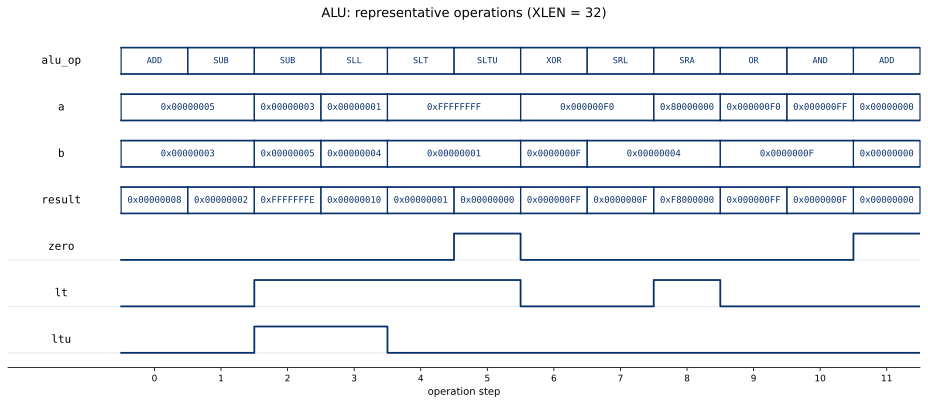
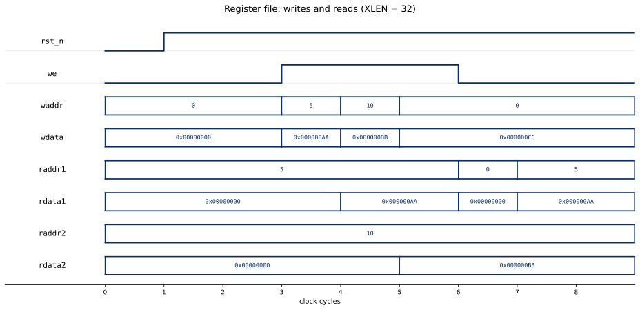

# alu

[](https://github.com/drewbabel/alu/actions/workflows/ci.yml)

A configurable arithmetic and logic unit written in SystemVerilog.

The ALU implements a subset of RV32I operations (add, subtract, logical, and shift instructions) combinationally from two input operands and an operation select signal. It computes the result, zero flag, and signed/unsigned less-than flags required for branch instructions. A register file provides a dual-port synchronous SRAM with read ports and masked write support. Shared RV32I types, such as the operation enum, live in `alu_pkg`, which is intended to grow into a core-wide package in a separate single-cycle RV32I CPU project that reuses these blocks.

The ALU is verified with a self-checking testbench and an exhaustive SymbiYosys formal proof, and the register file with a self-checking testbench.





## Interface

### `alu`

| Signal | Direction | Width | Description |
|--------|-----------|-------|-------------|
| `a` | in | `XLEN` | First operand |
| `b` | in | `XLEN` | Second operand |
| `alu_op` | in | 4 | Operation select (alu_pkg::alu_op_e) |
| `result` | out | `XLEN` | Arithmetic/logic result |
| `zero` | out | 1 | Result is zero |
| `lt` | out | 1 | Signed less-than |
| `ltu` | out | 1 | Unsigned less-than |

### `regfile`

| Signal | Direction | Width | Description |
|--------|-----------|-------|-------------|
| `clk` | in | 1 | System clock |
| `rst_n` | in | 1 | Synchronous active-low reset |
| `we` | in | 1 | Write enable |
| `waddr` | in | `AWIDTH` | Write address |
| `wdata` | in | `XLEN` | Write data |
| `raddr1` | in | `AWIDTH` | Read address 1 |
| `raddr2` | in | `AWIDTH` | Read address 2 |
| `rdata1` | out | `XLEN` | Read data 1 |
| `rdata2` | out | `XLEN` | Read data 2 |

## Parameters

| Parameter | Default | Description |
|-----------|---------|-------------|
| `XLEN` | `32` | Data width (ALU and regfile) |
| `AWIDTH` | `5` | Address width (regfile: 32 entries) |

## Operations

| Operation | Code | Behavior |
|-----------|------|----------|
| `ALU_ADD` | 0 | a + b |
| `ALU_SUB` | 1 | a - b |
| `ALU_SLL` | 2 | a << b[4:0] (shift left logical) |
| `ALU_SLT` | 3 | signed a < b ? 1 : 0 |
| `ALU_SLTU` | 4 | unsigned a < b ? 1 : 0 |
| `ALU_XOR` | 5 | a ^ b |
| `ALU_SRL` | 6 | a >> b[4:0] (shift right logical) |
| `ALU_SRA` | 7 | a >>> b[4:0] (shift right arithmetic) |
| `ALU_OR` | 8 | a \| b |
| `ALU_AND` | 9 | a & b |

## Verification

| Module | Method |
|--------|--------|
| `alu` | Self-checking testbench and SymbiYosys formal proof |
| `regfile` | Self-checking testbench |

Since the ALU is combinational, a single-step bounded proof checking every output against a reference model is exhaustive over all operand pairs and operations, certifying `result`, `zero`, `lt`, and `ltu` for the entire input space.

## Results





## Building and running

Every module builds from the top-level Makefile.

```
make MOD=alu             # run a module's testbench
make wave MOD=alu        # run the testbench and open the waveform in Surfer
make formal MOD=alu      # run the module's SymbiYosys proof
./synth_stats.sh alu     # report a module's synthesis cost
```

## Synthesis

Synthesized for the Digilent Basys 3 (Xilinx Artix-7). sv2v converts the SystemVerilog to Verilog-2005 before synthesis, since Yosys's built-in frontend cannot parse package-scoped port types.

| Module | LUTs | Flip-flops | Carry cells |
|--------|------|------------|-------------|
| `alu` | 493 | 0 | 22 |
| `regfile` | 916 | 992 | 0 |

### Tool versions

Icarus Verilog 13.0, Yosys 0.66, sv2v 0.0.13, and Surfer.
