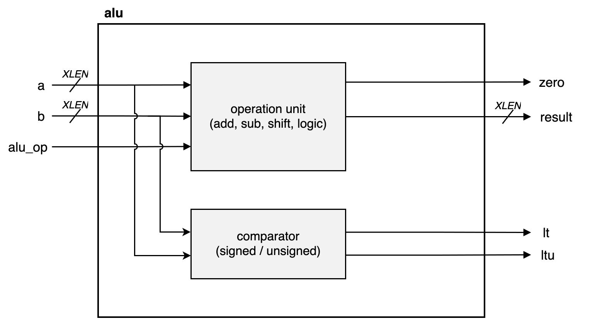
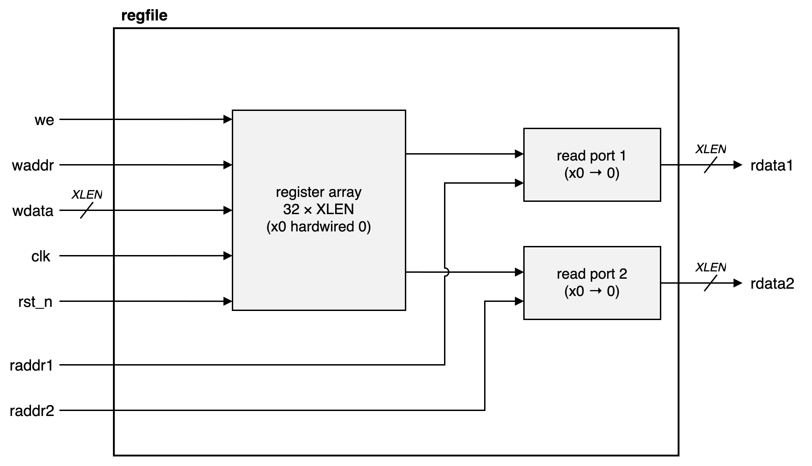

# alu

[](https://github.com/drewbabel/alu/actions/workflows/ci.yml)

A configurable RV32I arithmetic and logic unit and register file in SystemVerilog, with:

- Combinational add, subtract, logical, and shift operations from two operands and an operation select.
- Zero, signed less-than, and unsigned less-than flags for the branch instructions.
- A register file with two combinational read ports, one synchronous write port, and `x0` hardwired to zero.
- Shared RV32I types in `alu_pkg`, reused by a separate single-cycle RV32I core.





## Verification

| Module | Method |
|--------|--------|
| `alu` | Self-checking testbench + exhaustive SymbiYosys proof |
| `regfile` | Self-checking testbench |

The ALU proof is exhaustive over every operand pair and operation, which the combinational datapath admits.

## Implementation

Utilization comes from AMD Vivado 2026.1 out-of-context synthesis for the Xilinx Artix-7 XC7A35T, and the frequencies come from Vivado place-and-route of the `fmax/` harnesses.

| Module | LUTs | Flip-flops | Fmax |
|--------|------|------------|------|
| `alu` | 432 | 0 | 146.6 MHz |
| `regfile` | 608 | 992 | 285.5 MHz |

`fmax.sh` places and routes each module in a registered-boundary harness, and `vivado/fmax.tcl` drives the same harnesses to reproduce the frequencies above.

## Building and running

```
make MOD=alu                # run a module's testbench
make wave MOD=alu           # run the testbench and open the waveform in Surfer
make formal MOD=alu         # run the module's SymbiYosys proof
make trace MOD=alu          # print a formal counterexample as text
make view-formal MOD=alu    # open a formal waveform in Surfer
./fmax.sh alu tt_alu clk    # fmax and utilization
```

### Tool versions

Icarus Verilog 13.0, Yosys 0.66, nextpnr-xilinx 0.8.2, sv2v 0.0.13, and Surfer.
